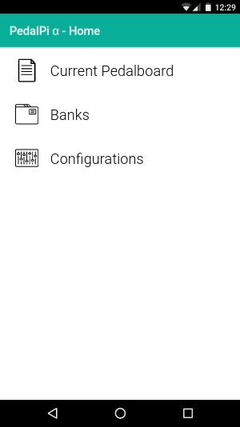
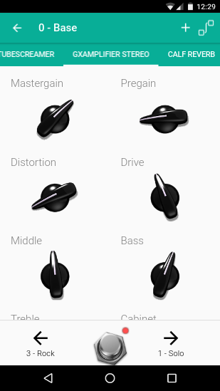
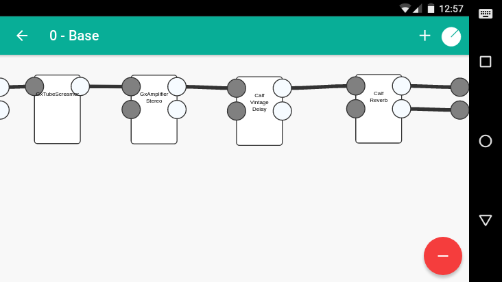
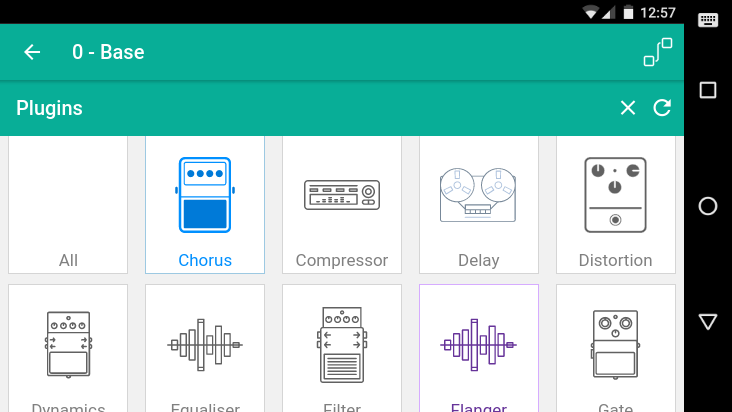

# Pedal Pi Apk - v0.6.0

[](https://travis-ci.org/PedalPi/Apk)

Manage your pedalboards in an app.

## Use

* Online: http://PedalPi.github.io/Apk
* Android: Comming soon
  * use `ionic cordova run android -a -l -c` or `ionic cordova build android`
  * If android 16 <= SDK < 28 then is necessary change `platforms/android/build.gradle` `defaultMinSdkVersion=19` => `defaultMinSdkVersion=16`
* iOS: Comming soon

## Screenshots









## Development

### Configure

```
npm install -g ionic
git clone https://github.com/PedalPi/Apk Apk
cd Apk
npm install
ionic serve -b -a
```

## Old versions

* **v0.6.0**: http://PedalPi.github.io/Apk
* **v0.5.0 Beta 1**: http://PedalPi.github.io/Apk
* **v0.4.0 Alpha 3**: http://PedalPi.github.io/Apk/old/alpha-3
* **v0.3.0 Alpha 2**: http://PedalPi.github.io/Apk/old/alpha-2
* **v0.2.0 Alpha 1**: Web build not generated
* **v0.1.0**: http://PedalPi.github.io/Apk/old/alpha-0

### How to build

Execute `npm run ionic:build --prod` for generate.
Move to docs/