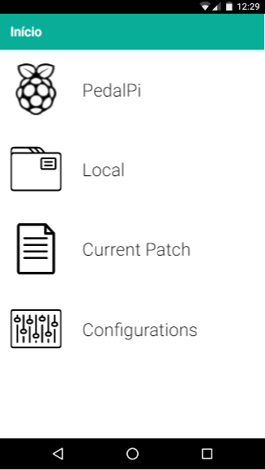
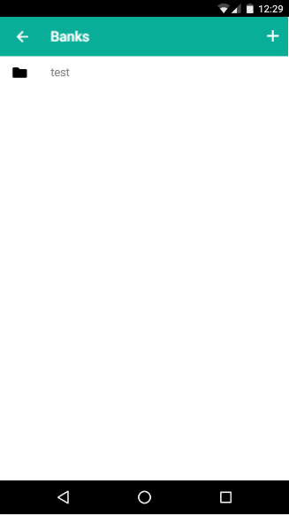
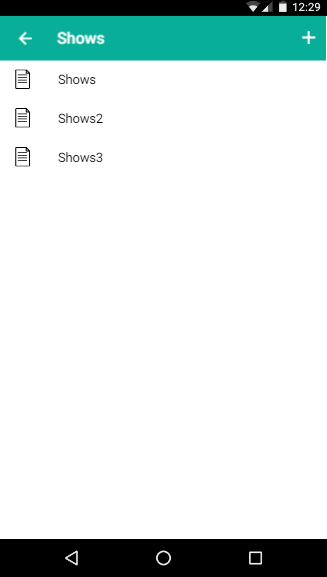
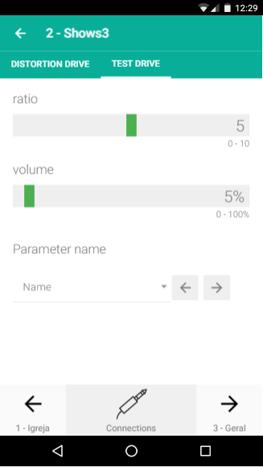

# PedalPi Apk

It's a work in progress project to manager the patch and effects

## Usign

```
git clone https://github.com/PedalPi/Apk Apk
cd Apk
npm install
sudo npm install -g ionic@beta
ionic serve -p 3000 -a
```

## Test

```
npm install -g codeceptjs
npm install -g webdriverio

cd test

# Download chromeDriver
wget http://selenium-release.storage.googleapis.com/2.53/selenium-server-standalone-2.53.1.jar
wget http://chromedriver.storage.googleapis.com/2.25/chromedriver_linux64.zip

#sudo apt-get install unzip -y
unzip chromedriver_linux64.zip

java -jar selenium-server-standalone-2.53.1.jar -Dwebdriver.chrome.driver="./chromedriver" &

codeceptjs run --steps
```

### Test 2

Test a alpha in http://PedalPi.github.io/Apk

### Reference Links

 * http://ionicframework.com/docs/v2/cli/serve/

## Screenshots








